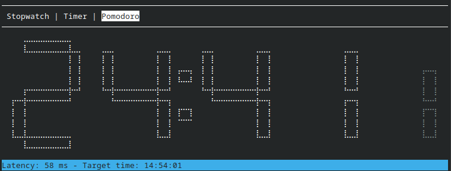

# timer-rs

A small TUI timer app written in Rust



## Set up

On Linux you will need to install alsa dev bindings
so the timer can beep when the time has elapsed

### Debian-based distributions

```bash
sudo apt-get update && sudo apt-get install libasound2-dev libudev-dev
cargo run
```

### RedHat-based distributions

```bash
sudo dnf install alsa-lib-devel
cargo run
```

### macOS

```bash
cargo run
```